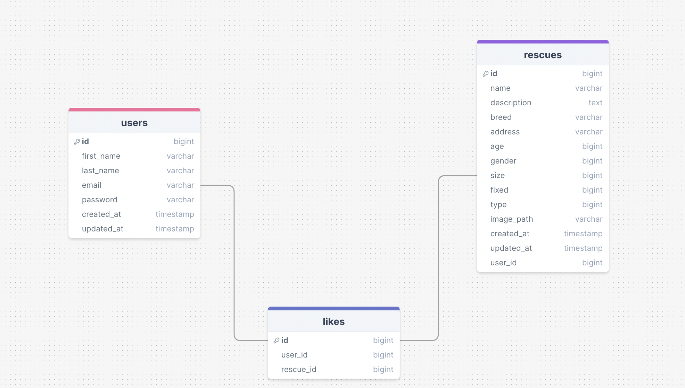

# Paws and Rescue

## Description:
Paws and Rescue is a web application designed to help users manage rescue animals. It provides a platform to create, view, and manage rescue animal profiles. The application uses Python with the Flask framework for the backend, MySQL for the database, and Bulma.io for the front-end styling. Future plans include expanding this to a full-stack project with a frontend framework.

### Tools Used:
- **Python (Flask)**: Used for building the backend server and handling API requests.
- **SQL (MySQL)**: Used for the relational database to store user and rescue animal information.
- **Bulma.io**: A modern CSS framework used for styling the frontend.

### API Routes:
- **User Routes:**
  - `GET /`: Render the home page with login and registration forms.
  - `POST /users/register`: Register a new user.
  - `POST /users/login`: Log in an existing user.
  - `GET /users/logout`: Log out the current user.
  - `GET /api/users/rescues/<int:id>`: Retrieve the rescues for a specific user.

- **Rescue Routes:**
  - `GET /api/v1/rescues/dashboard`: Retrieve a list of all rescue animals.
  - `GET /api/v1/rescues/new`: Render the form to create a new rescue animal profile.
  - `POST /api/v1/rescues/create`: Create a new rescue animal profile.
  - `GET /api/v1/rescues/edit/<int:id>`: Render the form to edit an existing rescue animal profile.
  - `POST /api/v1/rescues/update`: Update an existing rescue animal profile.
  - `GET /api/v1/rescues/show/<int:id>`: Retrieve details of a specific rescue animal.
  - `POST /api/rescues/delete`: Delete a specific rescue animal profile.

- **Like Routes:**
  - `POST /api/likes`: Like a rescue animal profile.
  - `DELETE /api/likes`: Unlike a rescue animal profile.

### Future Plans:
The project aims to expand into a full-stack application by integrating a modern frontend framework, making it a more robust and interactive platform for managing rescue animals.

### Database Design:
The database consists of three main tables: `users`, `rescues`, and `likes`.

- **Users Table**: Stores user information.
  - Columns: `id`, `first_name`, `last_name`, `email`, `password`, `created_at`, `updated_at`.

- **Rescues Table**: Stores rescue animal profiles.
  - Columns: `id`, `name`, `description`, `breed`, `address`, `age`, `gender`, `size`, `fixed`, `type`, `image_path`, `created_at`, `updated_at`, `user_id`.

- **Likes Table**: Stores likes by users for rescue animals.
  - Columns: `user_id`, `rescue_id`.

  <!-- Add the path to your ERD image here -->

### Installation:
1. Clone the repository:
    ```bash
    git clone <repository-url>
    cd paws-and-rescue
    ```

2. Create a virtual environment:
    ```bash
    python3 -m venv venv
    source venv/bin/activate  # On Windows use `venv\Scripts\activate`
    ```

3. Install the required packages:
    ```bash
    pip install -r requirements.txt
    ```

4. Set up the database:
    - Ensure you have MySQL installed and running.
    - Create a database and import the schema provided in `database_schema.sql`.

5. Set up environment variables:
    - Create a `.env` file in the root directory of your project.
    - Add the following environment variables:
      ```plaintext
      FLASK_APP=app.py
      FLASK_ENV=development
      SECRET_KEY=<your_secret_key>
      DATABASE_URI=mysql+pymysql://<username>:<password>@<host>/<database_name>
      UPLOAD_FOLDER=static/images
      ```

6. Run the application:
    ```bash
    flask run
    ```

### Usage:
- Access the application at `http://127.0.0.1:8080/`.
- Use the provided routes to interact with the application.

### Contribution:
Feel free to fork this repository, make improvements, and submit a pull request. Any contributions to enhance the project are welcome!

### License:
This project is licensed under the MIT License. See the LICENSE file for more details.
